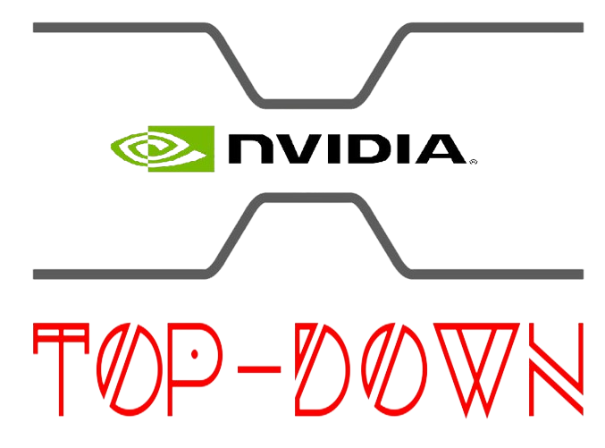

# TopDown over NVIDIA's GPUs
<!--
*** Thanks for checking out the Best-README-Template. If you have a suggestion
*** that would make this better, please fork the repo and create a pull request
*** or simply open an issue with the tag "enhancement".
*** Thanks again! Now go create something AMAZING! :D
-->


<!-- PROJECT SHIELDS -->
<!--
*** I'm using markdown "reference style" links for readability.
*** Reference links are enclosed in brackets [ ] instead of parentheses ( ).
*** See the bottom of this document for the declaration of the reference variables
*** for contributors-url, forks-url, etc. This is an optional, concise syntax you may use.
*** https://www.markdownguide.org/basic-syntax/#reference-style-links
-->
<!--[![Contributors][contributors-shield]][contributors-url]
[![Forks][forks-shield]][forks-url]
[![Stargazers][stars-shield]][stars-url]
[![Issues][issues-shield]][issues-url]
[![MIT License][license-shield]][license-url]
[![LinkedIn][linkedin-shield]][linkedin-url]-->


<!-- PROJECT LOGO -->
<br />
<p align="center">
  <a href="https://github.com/othneildrew/Best-README-Template">
    
  </a>

  <h3 align="center">TopDown NVDIA'S GPUs</h3>

  <p align="center">
    A model for analyzing the weaknesses of your program!
    <!-- <br />
    <a href="https://github.com/othneildrew/Best-README-Template"><strong>Explore the docs »</strong></a>
    <br />
    <br />
    <a href="https://github.com/othneildrew/Best-README-Template">View Demo</a>
    ·
    <a href="https://github.com/othneildrew/Best-README-Template/issues">Report Bug</a>
    ·
    <a href="https://github.com/othneildrew/Best-README-Template/issues">Request Feature</a>-->
  </p>
</p>


<!-- TABLE OF CONTENTS -->
<details open="open">
  <summary>Table of Contents</summary>
  <ol>
    <li>
      <a href="#about-the-project">About The Project</a>
    </li>
    <li>
      <a href="#getting-started">Getting Started</a>
      <ul>
        <li><a href="#prerequisites">Prerequisites</a></li>
        <li><a href="#installation">Installation</a></li>
      </ul>
    </li>
    <li><a href="#usage">Usage</a></li>
    <li><a href="#license">License</a></li>
  </ol>
</details>


<!-- ABOUT THE PROJECT -->
## About The Project
The TopDown tool analyzes the bottlenecks of applications running on NVIDIA GPUs. The tool supports ANY TYPE of application running on your GPU.

The objective of the application is to try to detect the parts of the architecture that have suffered the most during the execution of the application. In other words, it is intended to check the parts of the architecture that have been stalled during the execution of a given application. The objective is to verify that parts of your GPU architecture have caused a loss of IPC (Instructions per Cycle) compared to the ideal IPC of your GPU (that is, the maximum IPC that your GPU can achieve). For this, an exhaustive analysis of the different parts of the architecture will be carried out, to try to clarify the losses.

To carry out the above tasks, the application has several levels of execution. As we go deeper and lower levels, the level of detail ofthe results will increase, providing specific parts of the architecture. The highest level offers less detail, grouping more parts of the architecture into one. 

The TopDown tool analyzes the bottlenecks of applications running on NVIDIA GPUs. The tool supports ANY TYPE of application running on your GPU.

The objective of the application is to try to detect the parts of the architecture that have suffered the most during the execution of the application. In other words, it is intended to check the parts of the architecture that have been stalled during the execution of a given application. The objective is to verify that parts of your GPU architecture have caused a loss of IPC (Instructions per Cycle) compared to the ideal IPC of your GPU (that is, the maximum IPC that your GPU can achieve). For this, an exhaustive analysis of the different parts of the architecture will be carried out, to try to clarify the losses.

To carry out the above tasks, the application has several levels of execution. As we go deeper and lower levels, the level of detail ofthe results will increase, providing specific parts of the architecture. The highest level offers less detail, grouping more parts of the architecture into one. 


<!-- GETTING STARTED -->
## Getting Started

Throughout this section we will discuss how the application should be used correctly, as well as the necessary utilities for it to work correctly. 

### Prerequisites

This application is developed in Python, so it will be necessary to have a python compiler to be able to execute the program. It is advisable to have a sufficiently updated version, since the code has elements that are not typical of old versions (less than python3). This is why it is essential to have at least one version of python3 installed.

The following summarizes the commands necessary to install a stable version of python3 for this application: 

* python3 (version 3.6)
```bash
  # update repositories
  sudo add-apt-repository ppa:jonathonf/python-3.6

  # update
  sudo apt-get update

  # install
  sudo apt-get install python3.6

  # this command must return the version (3.6) without errors	
  python3.6 -V
```
In the same way, remember that it is also necessary that you have the necessary CUDA toolkit to be able to do the analysis. The program automatically detects your GPU (Compute Capbility or CC) version and performs the analysis with the appropriate tool. You should only have the appropriate one installed for your GPU. The two analysis tools are as follows:
<ul>
<li>Nvprof (CC < 7.2)</li>
<li>Nsight Compute (CC >= 7.2)</li>
</ul> 

The tool provided has the ability to determine the CC of your GPU. To do this, you must have a version of CUDA installed. If you do not have it installed, in section 3 of the following link, NVIDIA provides the necessary steps to perform this task:

* install CUDA (NVDIA reference)
```bash
https://docs.nvidia.com/cuda/cuda-installation-guide-linux/index.html
```

It is very important that you follow the steps in detail, without skipping any. In the same way, once the installation process has been carried out, you must carry out the "post-installation" process, through the following link (section 9)

* post-installation CUDA (NVDIA reference)
```
https://docs.nvidia.com/cuda/cuda-installation-guide-linux/index.html#post-installation-actions
```
Finalmente, la última tarea que debe realizar es la de otorgar permisos a la herramienta para medir los resultados. Para ello, siga los pasos mencionados en el enlace siguiente

* grant permission to measure results (NVDIA reference)
```
https://developer.nvidia.com/nvidia-development-tools-solutions-err_nvgpuctrperm-permission-issue-performance-counters
```

Once you have completed the CUDA installation, you are ready to use the tool to check your CC. To do this, **it is recommended that you go to the next section and install the tool**.

### Installation

1. Download the application
   ```bash
   git clone https://github.com/asf174/TopDownNvidia.git
   ```
2. Check Compute Capability [OPTIONAL]
    ```bash
    cd TopDownNvidia/src/measure_parts

    # run program. It returns the CC
    # Otherwise, error. CORRECT ERROR
    # in order to use the tool
    nvcc compute_capability.cu --run
    ```
3. Add program to PATH [OPTIONAL]
    ```bash
    # <PATH_UNTIL_TOPDOWN_REPOSITORY>: path until repository 
    echo "PATH=<PATH_UNTIL_TOPDOWN_REPOSITORY>/TopDownNvidia/src:$PATH" >> $HOME/.bashrc
    ```
4. Define the TopDown environment variable, i.e, the PATH until the repository
    ```bash
    # <PATH_UNTIL_TOPDOWN_REPOSITORY>: path until repository 
    echo "export DIR_UNTIL_TOPDOWN="<PATH_UNTIL_TOPDOWN_REPOSITORY>" >> $HOME/.bashrc
    ```
5. Update enviroment variable
    ```bash
    source $HOME/.bashrc
    ```
6. Install the tool dependencies
    ```bash
    # update pip
    python -m pip install --upgrade pip

    # install graph dependencies
    pip install matplotlib
    pip install plotly
    ```
7. Check Options [OPTIONAL]
    ```bash
    python3 topdown.py -h
    ```

<!-- USAGE EXAMPLES -->
## Usage

The command syntax is as follows:
```bash
topdown.py [OPTIONS] -f [PROGRAM] -l [NUM]
```

where [PROGRAM] is the path to your program to be analyzed and [NUM] is the level of the TopDown. Furthermore, you can run topdown.py with 
'-h' option to see ALL program features. Below is an example of all the available options:
```bash
$ topdown.py -h
usage: topdown.py [OPTIONS] -f [PROGRAM] -l [NUM]

TopDown methodology on NVIDIA's GPUs

Optional arguments:
  -h, --help                                                   show this help message and exit
  -f [PROGRAM [PROGRAM ...]], --file [PROGRAM [PROGRAM ...]]   run file. Path to file.
  -o [FILE], --output [FILE]                                   output file. Path to file.
  -v, --verbose                                                long description of results.
  -dc, --delete-content                                        If '-o/--output' is set delete output's file contents before write results.
  -nd, --no-desc                                               don't show description of results.
  -m, --metrics                                                show metrics computed by NVIDIA scan tool.
  -e, --events                                                 show eventss computed by NVIDIA scan tool.
  -am, --all-measurements                                      show all measures computed by NVIDIA scan tool.
  -g, --graph                                                  show graph with description of results.
  -og [OUTPUT_GRAPH_FILE], --output-graph [OUTPUT_GRAPH_FILE]  output graph file. Path to file.
  -os [OUTPUT_SCAN_FILE], --output-scan [OUTPUT_SCAN_FILE]     output scan file. Path to file.
  -is [INPUT_SCAN_FILE], --input-scan [INPUT_SCAN_FILE]        input scan file. Path to file.

Required arguments:
  -l [NUM], --level [NUM]                                      level of execution.

Check options to run program
```


<!-- MARKDOWN LINKS & IMAGES -->
<!-- https://www.markdownguide.org/basic-syntax/#reference-style-links -->
[contributors-shield]: https://img.shields.io/github/contributors/othneildrew/Best-README-Template.svg?style=for-the-badge
[contributors-url]: https://github.com/othneildrew/Best-README-Template/graphs/contributors
[forks-shield]: https://img.shields.io/github/forks/othneildrew/Best-README-Template.svg?style=for-the-badge
[forks-url]: https://github.com/othneildrew/Best-README-Template/network/members
[stars-shield]: https://img.shields.io/github/stars/othneildrew/Best-README-Template.svg?style=for-the-badge
[stars-url]: https://github.com/othneildrew/Best-README-Template/stargazers
[issues-shield]: https://img.shields.io/github/issues/othneildrew/Best-README-Template.svg?style=for-the-badge
[issues-url]: https://github.com/othneildrew/Best-README-Template/issues
[license-shield]: https://img.shields.io/github/license/othneildrew/Best-README-Template.svg?style=for-the-badge
[license-url]: https://github.com/othneildrew/Best-README-Template/blob/master/LICENSE.txt
[linkedin-shield]: https://img.shields.io/badge/-LinkedIn-black.svg?style=for-the-badge&logo=linkedin&colorB=555
[linkedin-url]: https://linkedin.com/in/othneildrew
[product-screenshot]: images/screenshot.png

